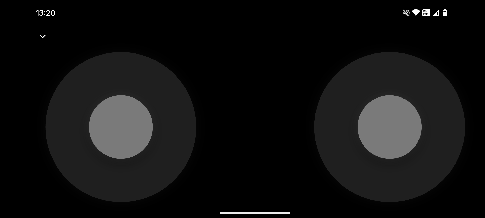
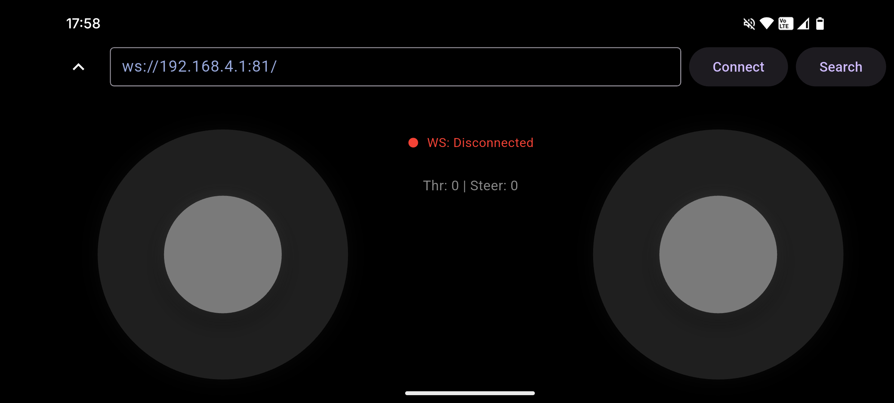

# ESP-RC Car Controller

This is the companion Flutter application for the ESP32-based RC car project. It provides a real-time, low-latency interface to control the car's throttle and steering over a WebSocket connection.

## Features

- **Real-time Control**: Low-latency vehicle control via a WebSocket interface.
- **Dual Control Modes**:
    - Responsive on-screen joysticks for touch-based control.
    - Full support for physical gamepads on both Android and iOS.
- **Automatic Discovery**: The app automatically finds the car on your local network.
    - **UDP Broadcast**: The primary method for quick discovery.
    - **TCP Subnet Scan**: A fallback that scans the entire local network to find the car.
- **Resilient Connectivity**: Automatically reconnects if the connection is lost.
- **Clean UI**: A simple, dark-themed interface that focuses on the driving experience.

## How to Control the Car

### On-Screen Controls
When no gamepad is connected, two virtual joysticks will be visible:

- **Left Joystick (Vertical)**: Controls Throttle (Forward/Reverse).
- **Right Joystick (Horizontal)**: Controls Steering (Left/Right).

### Physical Gamepad
Connect a standard Bluetooth or USB gamepad to your phone for a more tactile experience. The app will automatically detect it.

- **Left Stick (X-Axis)**: Steering
- **Right Trigger (R2/RT)**: Throttle (Forward)
- **Left Trigger (L2/LT)**: Brake / Reverse

## Connection Methods

The app is designed to connect to the ESP32 with minimal effort. It tries the following methods in order:

1.  **UDP Discovery**: On startup, the app sends a broadcast message over the network. The ESP32 is expected to respond with its IP address.
2.  **TCP Scan**: If UDP discovery fails, the app identifies your phone's local subnet (e.g., `192.168.1.0/24`) and scans every host on that network to find the car's WebSocket port.
3.  **Default Fallback**: If both discovery methods fail, it attempts to connect to `ws://192.168.4.1:81/`. This is the default address for when the ESP32 is running in its own Wi-Fi Access Point (AP) mode.
4.  **Manual Connection**: You can tap the "expand" icon at the top of the screen to open the developer panel, where you can manually enter a WebSocket URL and connect.

## Technology Stack

- **Framework**: Flutter
- **Connectivity**: `dart:io` for WebSockets, UDP Sockets, and TCP Sockets.
- **State Management**: `provider` with `ChangeNotifier`.
- **Native Integration**:
    - **Android (Kotlin)**: Uses `InputManager` to listen for native gamepad events.
    - **iOS (Swift)**: Uses the `GameController` framework to listen for native gamepad events.
